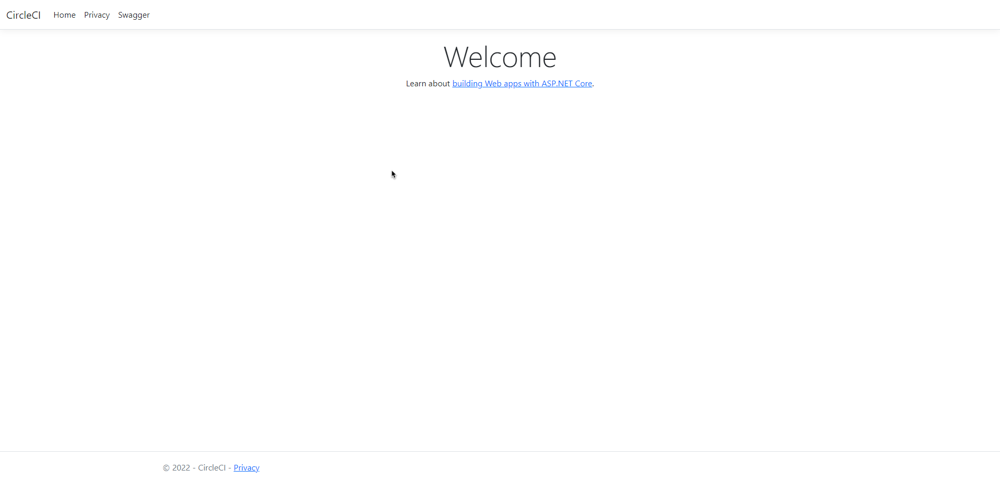
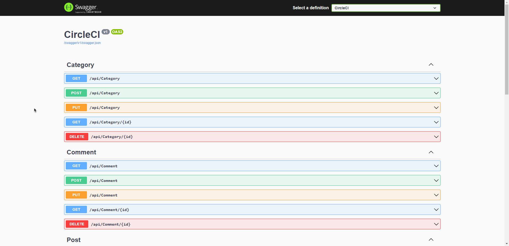
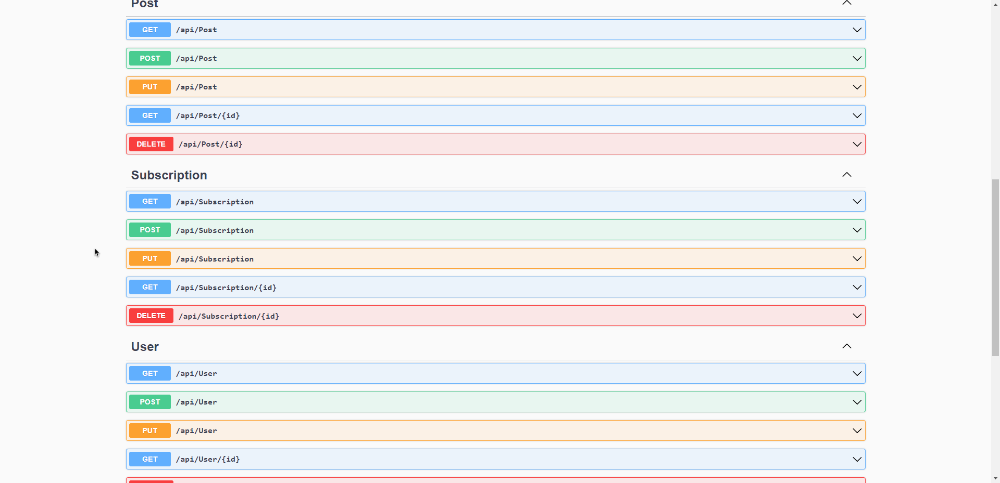

# circle-ci-back-end
# For start project use console with next command:
### `dotnet run`
# After running app you seen next:

Click on `Swagger` for check capabilities of this API:

# API writed with support GET/POST/PUT/DELETE methods for DB.
